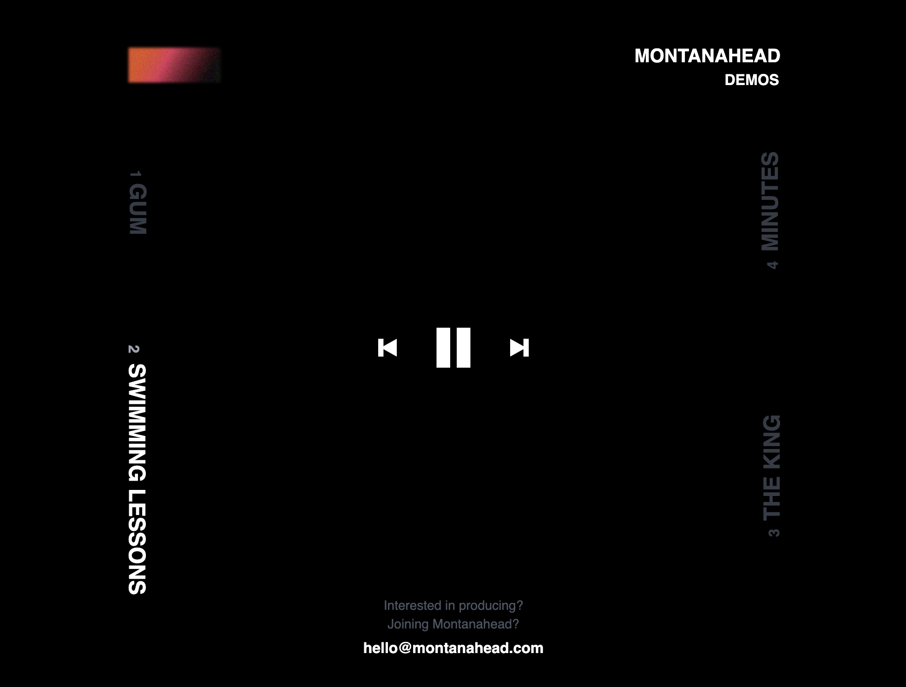

# Montanahead Demo Player v1

> Custom audio player for the band Montanahead's [Demos](www.montanahead.com)

## Table of Contents

- [General Info](#general-information)
- [Technologies Used](#technologies-used)
- [Features](#features)
- [Project Status](#project-status)
- [Roadblocks](#roadblocks)
- [Room for Improvement](#room-for-improvement)
- [Acknowledgements](#acknowledgements)

## General Information

In short, I wanted to make something unique for Montanahead's demo site. There are four songs and I thought it would be fun to use the track listing as the framing for the player. 

In addition, this site is linked from a QR code using qr.io that directs owners of the Demos cassette to the website for streaming.

I decided to use SvelteKit for the framework as I wanted more familiarity with it and it turned out to be a pretty seamless experience overall. 

## Technologies Used

- Svelte v3.44.0
- TailwindCSS v3.1.6
- Howler v2.2.3
- Vite v2.9.13
- Cloudinary

## Features

- mp3 streaming using Cloudinary and Howler.js
- Responsive design using Tailwind CSS

## Project Status

Version 1: _complete_

Version 2: _in progress_

## Roadblocks

I could write a novel on issues I've encountered working with audio on the web in the last few weeks. I incorporated [Howler](https://howlerjs.com/) as I'd worked with it in the past and it was fairly simple to set up and use. It didn't play nicely with Vite until I adjusted the Vite config to include all external sources.

I then tried uploading mp3s to Github via a standard commit (mistake) and that led me to try [Git LFS](https://git-lfs.github.com/) which, at first commit, seemed promising. The mp3s were hosted on Github in my repository but were unable to play when referenced in the site deployed on Vercel.

This then led me to seek out alternatives for streaming audio. I was recommended to check out [Amazon S3](aws.amazon.com) and while that very could have worked (in theory) with Cloudfront to serve the audio, it was way too far out of my wheelhouse to get working in a timely manner.

Finally, I was sent an article that outlined how someone used [Cloudinary](https://cloudinary.com/) to stream audio from a test site. This ended up being what works for the current version.

## Room for Improvement

- Needs a seek/scrub bar to navigate to different parts of songs. Currently, users can only play, pause, skip and manually select from the tracks available on screen. This, along with song length markers, are the main features to be introduced in Version 2.
- There are tentative plans to introduce lyrics (ex. Spotify) that cycle through each song based on duration. If this is implemented, it will be in a distant Version 3 as it isn't critical to the listening experience.
- There may also need to be some function work as the songs do not play automatically when one finishes, only when skipping to the next one.
- I've noticed some sizing issues on Safari and mobile so I'll have to take a closer look at those as well and adjust margin and padding for the footer.

## Acknowledgements

- Massive shoutout to [Jadon Scholes](https://github.com/jschol3s) for the constant help with troubleshooting Howler, S3, and everything in between on this project.
- Credit to [Olubisi Idris Ayinde](https://www.youtube.com/watch?v=rCselwxbUgA&t=134s&ab_channel=SonnySangha) for introducing me to Cloudinary for audio streaming purposes.

